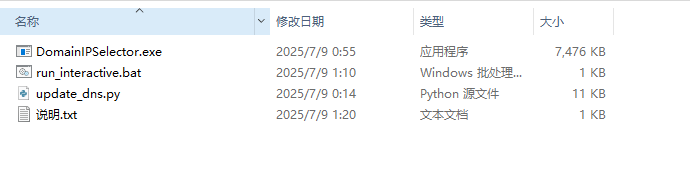
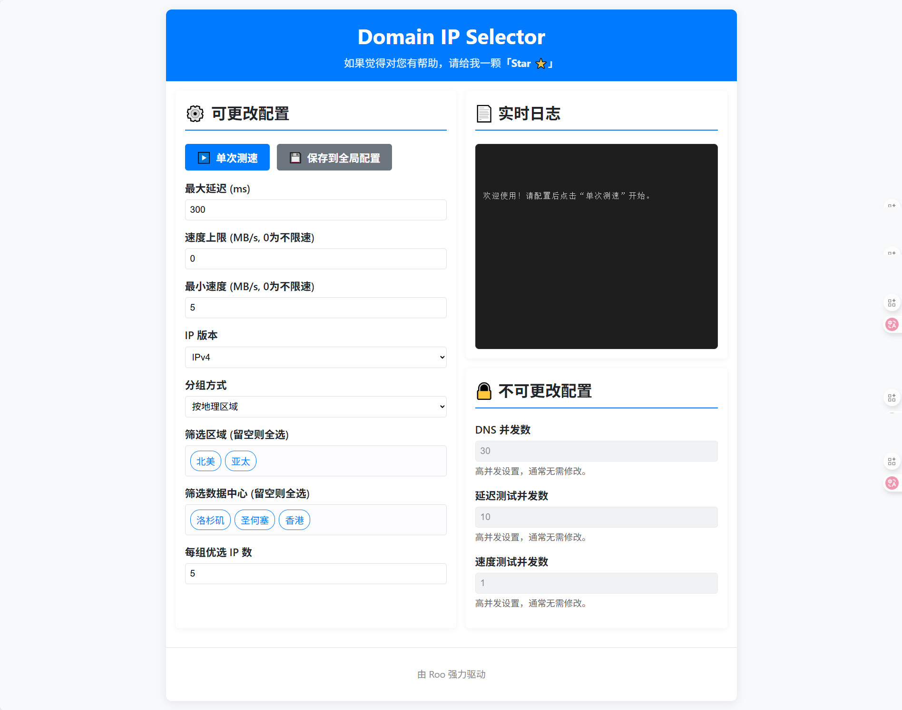
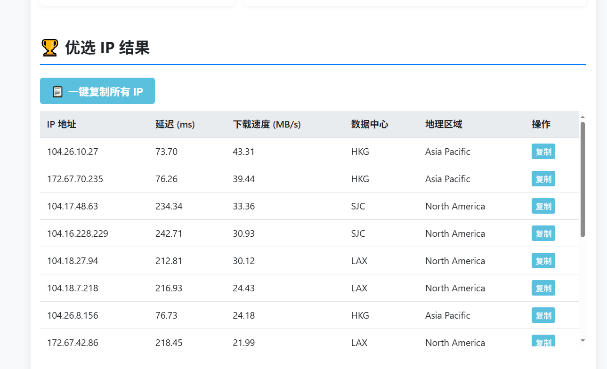
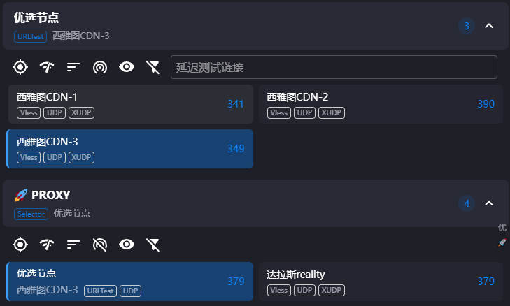
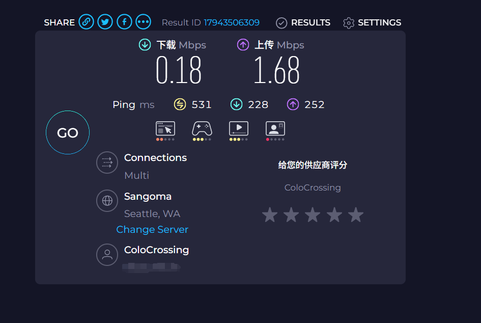
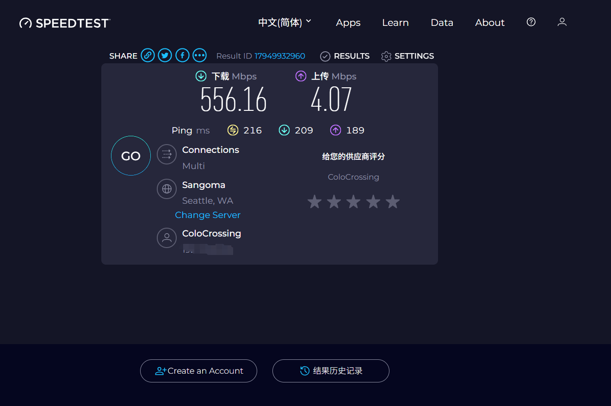

**基于信誉域名的优选IP工具**

做了一个小工具，可以方便的优选cloudflareIP

**仓库地址：** [Domain_IP_Selector](https://github.com/ccxkai233/Domain_IP_Selector)

因为买到的vps线路实在是太垃了，所以一直在想办法折腾cloudflare大善人。

`先在这里给大善人磕一个，别封我的号，封了我再注册一个。`

## 原理说明

说一下原理，一开始看了不少youtube的优选IP的视频，也找了不少的资源，找着找着发现某博客提供了一连串优选域名。

于是我就问chatGPT，**什么是优选域名？**


这里就要引出**域名与IP**是怎么工作的了。

### DNS查询流程

当我们发起DNS查询时，查询过程是这样的：

1. **本地查询** - 首先向上游的DNS服务器进行查询
  * 可能是你家的路由器
  * 也可能是你的网络运营商（ISP）
2. **递归查询** - 如果本地DNS服务器不知道答案
  * 会继续向上级DNS服务器查询
  * 层层递归，直到找到答案
3. **获得结果** - 最终汇集到一个知晓这个域名对应IP的DNS服务器
  * DNS服务器将域名对应的IP返回给你
  * 于是你的浏览器就知道了：

> 哦，我访问这个域名要通过这个IP。

于是直接向这个IP发起连接。

### 优选域名的作用

那我们能用优选域名做什么呢？

具体到代理场景，当我们的代理域名打开了小黄云之后，我们的电脑与代理之间的连接就委托给了cloudflare。

大善人就会分给我们一两个IP，用来连接这个域名。

但是默认分的这一两个IP一般都不怎么好使（虽然哪怕是默认也比我的垃圾VPS好使多了，到底有多垃圾，下面有图。）

于是很多人就会优选IP或域名。

### 配置示例

以这个节点为例:

```
  - name: 洛杉矶CDN-1
    type: vless
    server: 优选.域名.com
    port: 443
    udp: true
    uuid: 6dc36cb3-8pz8-9t71-b428-399b667adab9
    network: ws
    tls: true
    encryption: none
    servername: vps.域名.xyz
    ws-opts:
      path: /abcdefg
      headers:
        Host: vps.域名.xyz
```

显然这是一个套上了CDN的节点，因为SEVER和SERVERNAME不一样。

这个代理是一个VLESS-WS-TLC代理。

### 连接流程

当客户端发起连接时，会连接`优选.域名.com`进行DNS查询，查到了一个cloudflareIP。

于是客户端发起TLS握手，发送 `SNI：vps.域名.xyz`

cloudflare一看：“原来是找`vps.域名.xyz桑`的，虽然没有连到我分配给它的IP，但还是给它送过去吧。”

于是你的流量就通过一个高速的优选IP,进入了cloudflare内部的高速骨干网，然后流向你的VPS。

这时，**VPS**上的**Nginx**正在发呆。

突然，它收到 TLS 握手请求，抬头一看：

> “Cloudflare过来滴干活？良民证（SNI）拿出来！——呦西，`vps.域名.xyz`，良民，过去吧！”

然后流量到达了xray。

Xray一看：

```
"WS 路径/abcdefg-正确
Host vps.域名.xyz-正确，
UUID 6dc36cb3-8pz8-9t71-b428-399b667adab9-正确
非常好，全部对上了思密达。
让我看看你要访问什么什么网站……啧啧啧，居然是这个网站————过去吧！"
```

### 完整流程图

整个流程是这样的：

```
客户端
  │
  ├── ① DNS 查询（优选域名 → Cloudflare IP）
  │
  ├── ② 发起 TLS 握手 (SNI: vps.域名.xyz)
  │
  ▼
Cloudflare CDN（中继/反代，不解密 TLS）
  │
  ▼
VPS: Nginx（443 端口） ← ③ TLS 解密在这里完成
  │
  ├── ④ 检查 HTTP 请求：Host、Path、Upgrade 等
  │
  └── ⑤ 匹配到代理路径 → 反代给 Xray（127.0.0.1:10000）
          │
          ▼
      Xray（WebSocket 请求内部的 VLESS 协议）
          │
      ⑥ 检查 UUID、解密数据流、处理出站
          │
          ▼
      转发到不可言说的目标网站

```

这就是为什么可以直接将优选域名填到代理里使用了。

## 项目思路

说回到我这里，当我知道了背后的原理后，就开始想：可不可以用域名来获得优选IP呢，于是一查，还真可以。

如果我们通过一系列使用cloudflareCDN的**不会被GFW阻断**且是**cloudflare付费用户**的域名来获得IP，那么大概率获得的就是一个好IP。

然后我们再**优中选优**获得我们当前网络环境中，最好的一个IP。

于是本项目应运而生。

### 域名来源

项目里默认提供了从全球195个国家和地区的政府官网和全球前100强企业中筛选出的，接入cloudflareCDN的官网，以及从网络上获得的一些优选域名。

这些网站几乎不可能被GFW干扰DNS查询，而且几乎可以肯定是cloudflare**付费**用户，当我们进行查询的时候，大概率会获得内部调度系统给出的最优IP。

## 使用方法

下面讲解具体的使用方法。

大家都是小白过来的，因此我也为了小白做了大量的优化（防小白设置）

### 下载和启动

当你从 [Release](https://github.com/ccxkai233/Domain_IP_Selector/releases)下载好Domain_IP_Selector.zip之后，在本地解压，你看到的应该是这样的：




直接双击`DomainIPSelector.exe`，会自动打开一个网页。



### 配置参数

左边的就是可以配置的：

* **延迟设置**：比如你接受不了多大的延迟，写上去。
* **速度上限**：如果你不想在自动测速的时候跑满带宽，干扰正常上网，将上限写上去，建议最大不超过30，高了也没意义，其实20MB/S的网速就可以看8K视频了。
* **最小速度**：就是你可以接受带宽的下限，当测速开始时，会按照延时顺序从前往后一个个测速。
* **IP版本**：可以选择是测IPV4还是IPV6，一般建议选IPV4，除非有特殊的偏好。

### 分组方式

然后就是分组方式，程序会按照你的分组方式来分组筛选，比如你可以按地区分组：北美、亚太、欧洲……

也可以按具体的城市（数据中心）分组：香港、洛杉矶、圣何塞……

这里为了照顾小白，只放上去了几个常用的，至少从我这里大概率查询到的都是北美或香港的IP，极少数是欧洲的（可能就4、5个）

* 如果你的vps在和我一样在美国，可以只选北美。
* 如果在香港或日本新加坡，可以选亚太（话说这几个地方的VPS是真贵啊，我是买不起……只能买买垃圾美国VPS了……）
* 当然你也可以留空，默认会从你DNS查询到的所有地区来分组，分别筛选。

**注意：**

* 当你选着**按地理筛选**时，只有**筛选区域 (留空则全选)**的内容会生效。
* 同理，当你选择**按数据中心筛选**时，只有**筛选数据中心 (留空则全选)**的内容会生效。

### 开始测速

当你配置好之后，记得点击**保存到全局配置**，这会覆盖掉默认的配置文件，后面你每次启动都会使用你自己的配置。

点击单次测速，就会执行一次优选IP,结束后网页自动滚动到最下方，你会获得一个列表、一个json文件和一个csv文件。

如果你是小白，你可以直接点击复制按钮。粘贴到你的v2rayN或者ClashVerge里。




## 不同用户的使用方式

### 小白用户

如果你是小白，你可以放心的使用本项目，网页只会接受正确的数值，也不怕连续点击测速按钮（MC红石圈里好像叫防小天才）。

### 进阶用户

如果你是大佬，那么json文件就是为你准备的，你可以方便的进行后续自动化。

如果你是大佬，有自动化需求，你可以阅读[readme](https://github.com/ccxkai233/Domain_IP_Selector)文件，里面详细介绍了如何自动化。

## 自动化脚本

压缩包里附带了一个自动测速并上修改托管到cloudflare的域名的A记录或AAAA记录，你可以参考制作适合自己的脚本，比如我是自己有一个windows服务器，我就每小时优选一次IP，然后更新3个子域名的A记录，这三个子域名就是优选IP。

我使用的是ClashVerge,主要是利用它的热切换机制，三个节点中如果有任何一个变慢了，都可以自动切换到其他节点。

> *因为做了家宽代理链，所以延迟比较高。*




## 效果对比

给大家看一下节点的前后对比图：

* 这是直连的，给我整笑了。




* 这是优选IP的，直接把我家的500M带宽跑满了。




`youtube4K毫无压力，但是8K相当的卡，按理说我的6800XT没问题啊，网速也没问题，用的edge浏览器，有知道为什么的大佬吗？`

## 注意事项

**注意：** 优选IP有封号风险，用来绑定优选IP的A记录最好新建一个小号，搞一个免费的或者几块钱的便宜域名。

另外劝大家测速薅羊毛也别太狠，小心把大善人惹急了跳起来给你膝盖两巴掌……

**优选有风险，代理需谨慎，上网不规范，封号两行泪。**

---

另外如果您对本项目的设计思路感兴趣，欢迎阅读这篇文章 [**Domain IP Selector - 设计思路**](https://github.com/ccxkai233/PublicDocuments/blob/main/Domain%20IP%20Selector%E7%9A%84%E8%AE%BE%E8%AE%A1%E6%80%9D%E8%B7%AF.md)

感谢您阅读到这里，如果佬们有建议或意见，欢迎提出来！